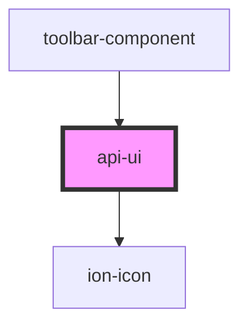

# api-ui

<!-- Auto Generated Below -->

## Properties

| Property    | Attribute    | Description | Type      | Default     |
| ----------- | ------------ | ----------- | --------- | ----------- |
| `closeIcon` | `close-icon` |             | `string`  | `'x.svg'`   |
| `isopen`    | `isopen`     |             | `boolean` | `undefined` |

## Dependencies

### Used by

 - [toolbar-component](../toolbar-component)

### Depends on

- ion-icon

### Graph

----------------------------------------------

*Built with [StencilJS](https://stenciljs.com/)*
