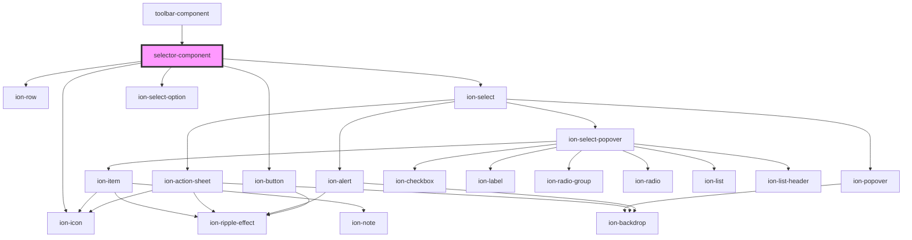

# selector-component

<!-- Auto Generated Below -->

## Properties

| Property         | Attribute   | Description | Type       | Default     |
| ---------------- | ----------- | ----------- | ---------- | ----------- |
| `DropDownvalues` | --          |             | `string[]` | `undefined` |
| `IconName`       | `icon-name` |             | `string`   | `undefined` |
| `element`        | `element`   |             | `string`   | `undefined` |
| `type`           | `type`      |             | `string`   | `undefined` |
| `value`          | `value`     |             | `string`   | `undefined` |

## Dependencies

### Used by

 - [toolbar-component](../toolbar-component)

### Depends on

- ion-row
- ion-select
- ion-select-option
- ion-button
- ion-icon

### Graph

----------------------------------------------

*Built with [StencilJS](https://stenciljs.com/)*
