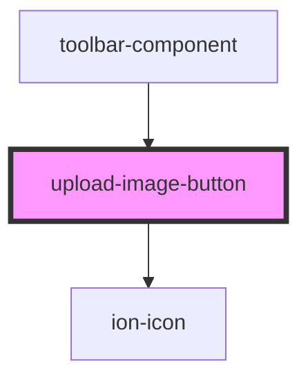

# upload-image-button

<!-- Auto Generated Below -->

## Properties

| Property      | Attribute     | Description | Type     | Default     |
| ------------- | ------------- | ----------- | -------- | ----------- |
| `URL`         | `u-r-l`       |             | `string` | `undefined` |
| `buttonvalue` | `buttonvalue` |             | `string` | `undefined` |

## Dependencies

### Used by

 - [toolbar-component](../toolbar-component)

### Depends on

- ion-icon

### Graph

----------------------------------------------

*Built with [StencilJS](https://stenciljs.com/)*
