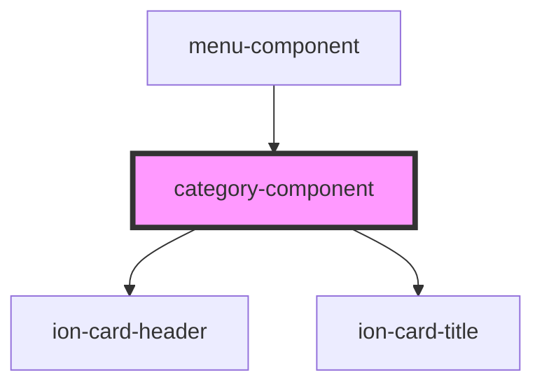

# category-component

<!-- Auto Generated Below -->

## Properties

| Property   | Attribute | Description | Type         | Default     |
| ---------- | --------- | ----------- | ------------ | ----------- |
| `category` | --        |             | `DBcategory` | `undefined` |

## Dependencies

### Used by

 - [menu-component](../menu-component)

### Depends on

- ion-card-header
- ion-card-title

### Graph

----------------------------------------------

*Built with [StencilJS](https://stenciljs.com/)*
