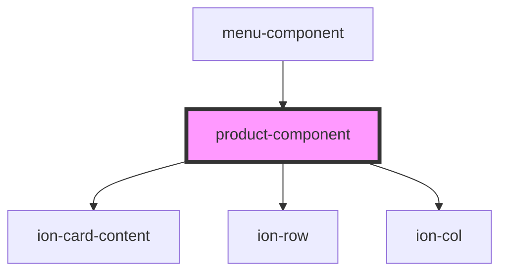

# product-component

<!-- Auto Generated Below -->

## Properties

| Property  | Attribute | Description | Type        | Default     |
| --------- | --------- | ----------- | ----------- | ----------- |
| `product` | --        |             | `DBproduct` | `undefined` |

## Dependencies

### Used by

 - [menu-component](../menu-component)

### Depends on

- ion-card-content
- ion-row
- ion-col

### Graph

----------------------------------------------

*Built with [StencilJS](https://stenciljs.com/)*
